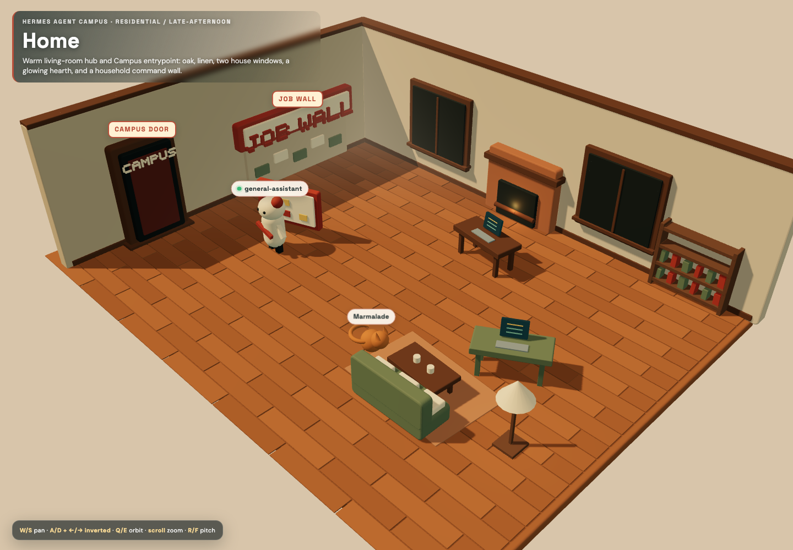
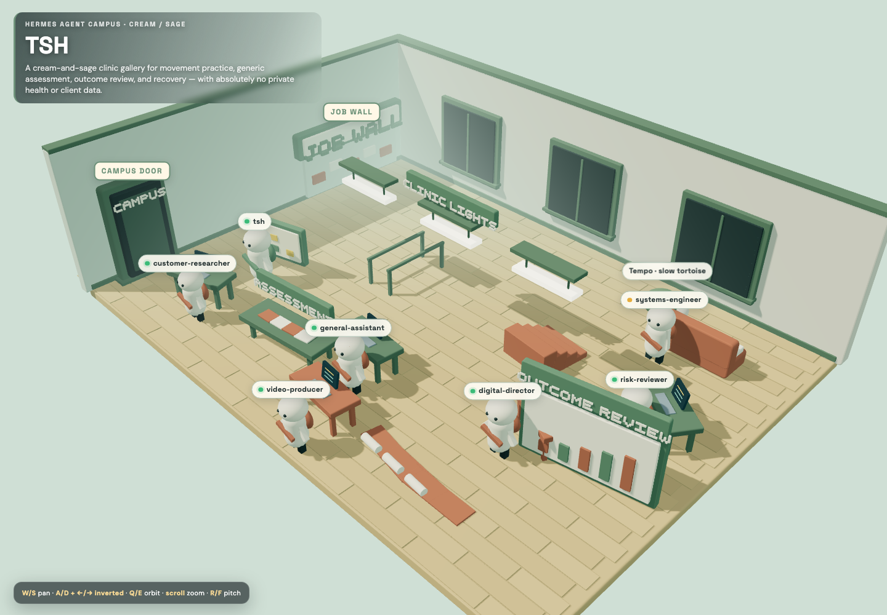
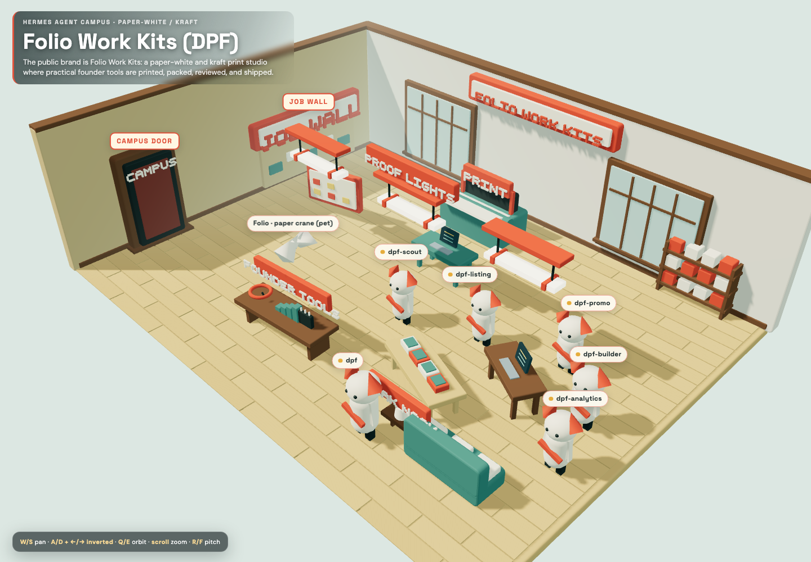
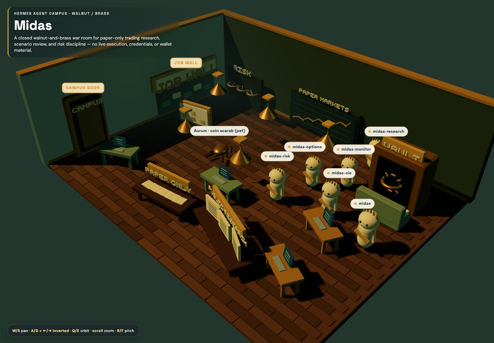
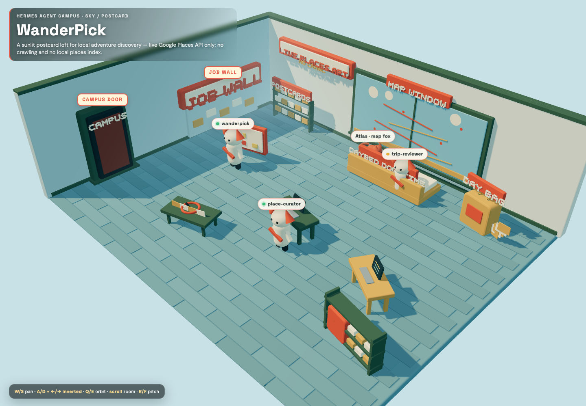
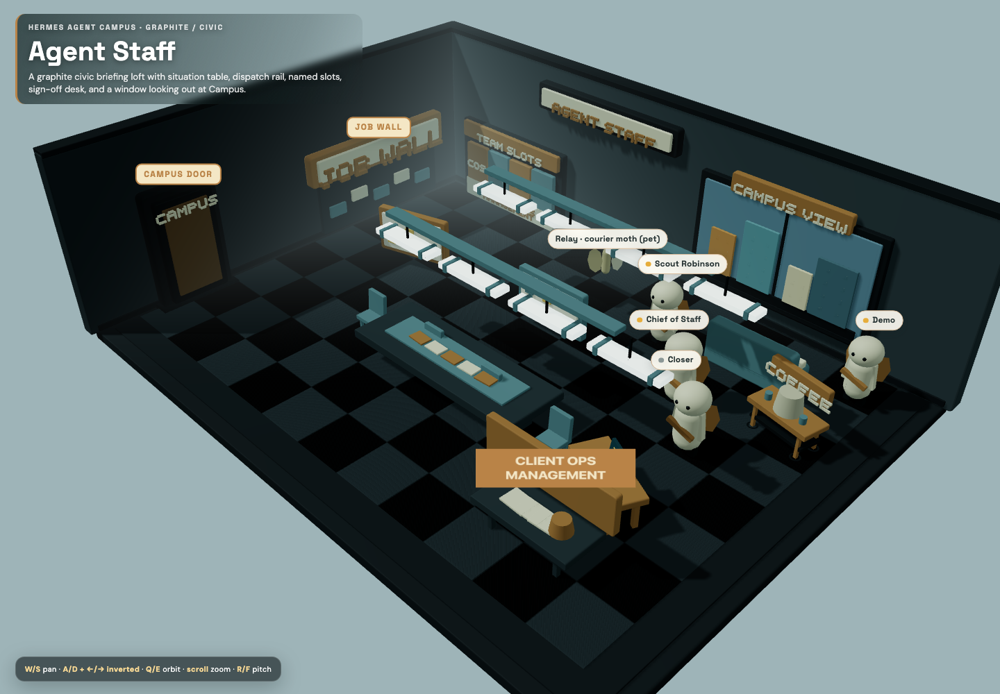

# Hermes Agent Campus

A privacy-first **ProjectContext → RoomSpec → shared Three.js runtime** that turns selected agent-project context into polished, interactive 3D rooms.

Campus is a visual operations surface: agents work or rest at role stations, project jobs live on an architectural JOB WALL, a room pet summarizes activity, and one Campus door connects every location. Room identity is validated data—not copied HTML.

> **Release status:** v1.0.0-rc.1, locally runnable release candidate. This repository does not deploy, publish, contact profiles, execute project work, trade, access health records, or call external services.

## Product wedge

### What it is

- A versioned, human-editable RoomSpec format for inhabitable project rooms.
- A deterministic generator for explicitly selected, sanitized project context.
- One shared renderer for architecture, camera, controls, agents, walking, collision avoidance, raycast interactions, pets, jobs, and navigation.
- A local reference implementation with six visually and behaviorally distinct rooms.
- A no-LLM path: hand-author a valid RoomSpec and render it directly.

### What it is not

- Not an agent executor, broker, health-record system, crawler, or secrets manager.
- Not a recursive indexer of a home directory.
- Not a claim that mock presence, usage, or job timestamps are live.
- Not a collection of cloned single-file room mockups.
- Not a hosted service or published package.

## Fresh-clone setup

Requires Node.js 20+.

```bash
git clone <your-fork-or-local-remote>
cd hermes-agent-campus
npm install
npx playwright install chromium
npm run check
npm run dev
```

Open <http://127.0.0.1:5173/?room=home>.

`npm run check` validates all contexts and RoomSpecs, runs unit tests, creates a production build, starts an isolated local server, and runs the complete Playwright browser suite.

## Demo path

1. Open **Home**.
2. Click an agent name tag to inspect status, model, mock usage, and current/last work.
3. Toggle that agent between work and downtime; the agent walks around obstacles instead of teleporting.
4. Click the room pet for the room digest.
5. Click the physical **JOB WALL** for only that room's jobs.
6. Click the physical **Campus** door, then warp to another room.

Direct room URLs:

| Room | Local URL |
|---|---|
| Home | `/?room=home` |
| TSH | `/?room=tsh` |
| Folio Work Kits (DPF) | `/?room=folio-work-kits` |
| Midas | `/?room=midas` |
| WanderPick | `/?room=wanderpick` |
| Agent Staff | `/?room=agent-staff` |

## Room gallery

### Home

Warm residential hub, oak boards and rug, two house windows, late-afternoon practicals, house cat, and household JOB WALL.



### TSH

Cream-and-sage clinic/fitness room with three clinic windows, pale maple, parallel bars, rehab stairs, assessment and outcome-review zones, recovery area, Chelonians, and a slow tortoise. All content is generic and contains no PHI.



### Folio Work Kits (DPF)

Paper-white and kraft product studio for the public brand **Folio Work Kits**, with birch boards, shop-front glazing, proof lights, print press, kits, packing, founder tools, break nook, and paper crane.



### Midas

Closed walnut/brass paper-trading war room with no exterior windows, Aureans, risk/research stations, a conceptual vault, PAPER ONLY language, lounge, and coin scarab. It contains no credentials, wallet material, or execution claims.



### WanderPick

Sky/postcard loft with painted wood, afternoon sun, a large map window and daybed, postcards, day bag, route cues, map fox, and the product truth: live Google Places API, with no crawling or local places index.



### Agent Staff

Graphite civic briefing loft with charcoal carpet tiles, Campus skyline window, civic light grid, situation table, dispatch rail, named slots, sign-off desk, window bench, coffee cart, and courier moth—without cloned X/Grok chrome.



## Architecture

```text
explicitly selected project-local sources
  → ProjectContext v1
  → schema validation + fail-closed privacy scan
  → deterministic RoomSpec v1 (or hand-authored RoomSpec)
  → shared Three.js renderer/runtime
  → optional room-scoped presence, usage, and cron adapters
```

Core paths:

- `schemas/project-context.schema.json` — sanitized input contract.
- `schemas/room-spec.schema.json` — versioned scene contract.
- `scripts/campus.mjs` — generate and validate CLI.
- `scripts/lib.mjs` — schemas, deterministic generation, and privacy checks.
- `src/runtime.js` — shared renderer and interaction runtime.
- `examples/contexts/` — sanitized JSON/YAML inputs.
- `examples/rooms/` — generated RoomSpecs.
- `rooms/` — six v1 production RoomSpecs.
- `docs/roomspec.md` — contract and authoring guide.
- `docs/architecture.md` — runtime, adapters, and visual-style mapping.

The browser validates a RoomSpec before creating WebGL. Invalid input produces an explanatory first-paint error instead of a silent black canvas.

## Visual system

The runtime uses an elevated 3/4 camera, layered cutaway architecture, wall thickness and caps, recessed framed openings, beveled matte geometry, broad key plus hemisphere fill, soft shadows, and restrained contact treatment. Room data chooses architecture, materials, lighting, openings, species, pet, downtime, props, and JOB WALL surface.

Controls:

- **W/S** — pan.
- **A/D and left/right** — intentionally inverted horizontal pan.
- **Q/E** — orbit.
- **Scroll** — zoom.
- **R/F** — pitch.
- **Escape** — close inspector or Campus map.

## Privacy boundary

Campus reads only sources explicitly selected by the user. ProjectContext source paths must be relative and cannot traverse upward. The sanitizer rejects personal filesystem paths, secret-like values, wallet/recovery material, PHI/client identifiers, and unrelated memory classes. Examples and production RoomSpecs contain no personal paths or credentials.

The browser receives RoomSpec data, not raw provider payloads. Every room declares `jobs_wall.job_scope`; the runtime and tests prevent global cron leakage. TSH uses generic, non-identifying copy. Midas uses mock, paper-only language.

## Deterministic no-LLM generation

```bash
npm run generate -- \
  --context examples/contexts/sample-studio.json \
  --out examples/rooms/my-studio.json

node scripts/campus.mjs validate --room examples/rooms/my-studio.json
```

The built-in generator records selected-source hashes and `llm_used: false`. A model adapter is optional and must return the same validated schema. A complete RoomSpec can always be authored by hand.

## Configuration

No API key is required to run the local renderer, generation, validation, or tests. See [`config.example.yaml`](config.example.yaml) for non-secret camera, map, and adapter settings. Provider credentials, if an optional adapter is developed, must come from the environment and must never enter ProjectContext, RoomSpec, logs, screenshots, or Git.

## Development commands

```bash
npm run dev        # local Vite server
npm run generate   # ProjectContext → RoomSpec
npm run validate   # validate every fixture and production RoomSpec
npm test           # unit/schema/privacy/identity tests
npm run build      # production bundle
npm run test:e2e   # HTTP, first paint, interactions, controls, raycasts, warp
npm run check      # complete release-candidate gate
```

See [CONTRIBUTING.md](CONTRIBUTING.md) before changing schemas, runtime behavior, or rooms.

## Historical prototypes

Files under `mockups/` are archived visual/interaction experiments. They are not loaded by v1. TSH and Midas now run from `rooms/*.json` through the same shared renderer as every other room.

## License

MIT. See [LICENSE](LICENSE).
